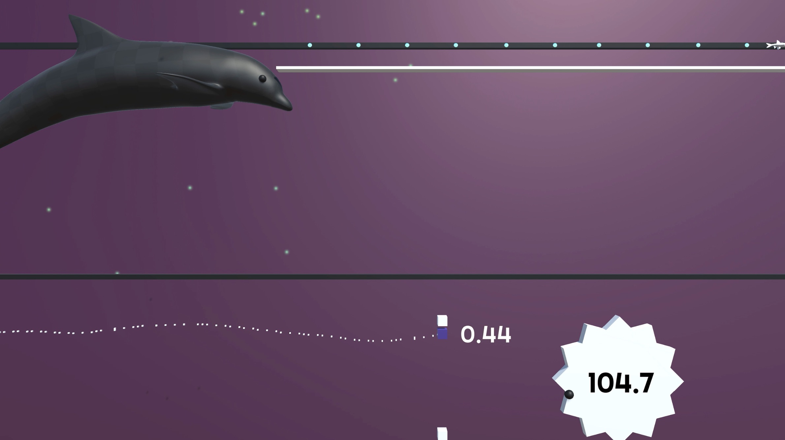

<h1>Unity for Humanity Talk<h1>
Thursday October 21, 2020 12:00pm - 12:30pm PDT

Internship Opportunities with Microsoft <a href="/msft_internships">here</a>

<h2>Quantifying and attenuating pathologic tremor in virtual reality</h2>
<h3><a href="https://arxiv.org/ftp/arxiv/papers/1809/1809.05970.pdf">Paper</a></h3>
<iframe width="560" height="315" src="https://www.youtube-nocookie.com/embed/DwxitB4x4VM" frameborder="0" allow="accelerometer; autoplay; clipboard-write; encrypted-media; gyroscope; picture-in-picture" allowfullscreen></iframe>

<h2>Neurophysiology Project</h2>

Project is still in development mode so I can't share the paper quite yet. See <a href="https://www.ncbi.nlm.nih.gov/pmc/articles/PMC5540667/">these</a> <a href="https://www.frontiersin.org/articles/10.3389/fncom.2018.00062/full">papers</a> that contextualize the current line of research.

>If you have questions feel free to drop me a note:  
>briancohn@kaspect.com